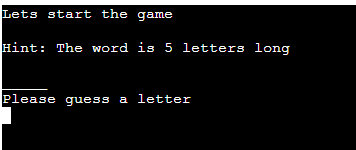

# Hangman 

This website has been created as the third Milestone project for Code Institute's Full Stack Software Development Diploma. It was built using Python. GitPod was used for writing the code for this website, as well as committing and pushing to GitHub. Once all the code had been written, Heroku was then used to deploy the website. 

### View the live website [here](https://hangman-command.herokuapp.com/)
***

## Table of content: 
 1. [Site Goals](#Site-Goals)
 1. [UX](#UX)
      1. [User Stories](#User-Stories)
      1. [Development Planes](#Development-Planes)
            * [Strategy](#Strategy)
            * [Scope](#Scope)
            * [Skeleton](#Skeleton)
            * [Surface](#Surface)
 1. [How to play](#How-to-play)
 1. [Features](#Features)
      * [Welcome Message for users](#a-welcome-message-for-users)
      * [Hint and User Input](#hint-and-user-input)
      * [Instant Feedback](#instant-feedback)
      * [Input Validation](#input-validation)
      * [Restart Game](#restart-game)
 1. [Testing](#Testing)
 1. [Bugs](#Bugs)
 1. [Unfixed Bugs](#Unfixed-bugs)
 1. [Technologies Used](#Technologies-Used)
 1. [Validation](#Validation)
 1. [Deployment](#Deployment)
 1. [Credits](#Credits)
 1. [Acknowledgements](#acknowledgements)
***
  

## Site Goals:

The goals for this site are as follows:
* To provide users with a fun, retro gaming experience.

[Please see the live site here](https://hangman-command.herokuapp.com/)

***
## UX:
## User stories:
### New User:
* As a new user, I am looking to play an online game of hangman.
* As a new user, I would like to play the game in a retro game environment. 
* As a new user, I would like to get live feedback on my inputs.

### Returning User:
* As a returning user, I would like to check if there have been any new words added.

***
## Development Planes:

As this is a backend project I did not have the use of HTML and CSS to make the user experience a good one, however, the aim is still to make the game as pleasing to a user as possible while maintaining the retro game style. This was done using the following process. 

***
## Strategy:

The strategy principal looks at user needs, as well product/service objectives. This website's target audience was broken down into two categories:

### Roles:
* New User
* Existing User

### Demographic:
* People aged between 16 & 55 years

### Psychographic:

#### Lifestyle:
* People with an interest in online games 
* People with an interest in vintage gaming

### The website needs to allow users to:

* Easily enter a username 
* Easily enter letters to play the game 
* Get live feedback on if the answer is correct or incorrect
* See the correct answer if run out of lives

### The website needs to allow the developer to:
* Keep track of the user's name 
* Keep track of all letters guessed and add them to a list, alerting the user if they have already guessed this letter.

*** 
## Scope:
With the structure in place, it was then time to move onto the scope plane. This was all about
developing website requirements based on the goals set out in the strategy plane. These requirements are broken down into two categories.

### Content Requirements:
1. What will the user be looking for as they play:
      * They will want to receive instant feedback as they go with regards to:
      * Lives remaining both visually (from the hangman) and written (as an alert)
      * Letters previously guessed
      * What the correct word is if they run out of lives 

### Functionality Requirements:
1. The user will be able to:
      * Add a username at the start of the game
      * Decide if they would like to go ahead with the game after reading the instructions
      * Decided if they would like to play again at the end of the game

*** 

## Skeleton:
The flowchart for this project was created using [Figma](https://www.figma.com/) and was a guide for the whole project. 

Flowchart

***

## Surface:
To make this game a bit more visually appealing to users I included colors throughout it. 
 * The game begins with a blue logo
 * The answer area is green
 * The hangman visual appears in red

***

## How to play:
The traditional Hangman games were played with pen and paper. It typically involved two players, one of which came up with the word and the other guessed the letters. For each incorrect answer, a body part gets added to the image until the second player either guessed the word or runs out the lives.

In this version of the game, the player will enter a name to start the game.
The computer will then randomly generate a word for the user the guess, as well as give them a hint as to how many letters are in the word. 

The user will take a turn by entering a letter via their keyboard and will receive instant feedback from the game if they have correctly guessed a letter for the word. 

For every incorrect answer, a life will be taken away and a body part will be added to the screen to represent that a life has been taken. If the user runs out of lives the hangman will be complete and the computer will alert the user that the game is over and what the word was. It will also ask the user if they would like to play the game again.

***

## Features:

The game had the following features:

## A welcome message for users:
* The user instantly sees a welcome message telling them the rules of the game and asking for a name. Once they have entered a valid name the computer then sends back a message that includes the name they entered

## Hint and User input:
* Once the user has decided the play the game the computer will give them a hint as to how many letters are in the word they need to guess and also ask them to start guessing letters 

## Instant Feedback:
* Throughout the game, the computer will give the user instant feedback on whether or not their guess is correct. 
* Correct guesses will appear on the screen as green letters
* Incorrect guesses as a red hangman visual. 

 
  
## Input Validation:
* The user will instantly receive feedback as to if they have entered a valid input or not

  

## Restart Game 
* Once the user has either used all their lives or guessed all the correct letters the computer will give the user the option to end the game or go again. 
 

***

## Future Features:
 
* Difficulty levels can be achieved by having separate sheets in excel with longer words and possibly adding a timer to the game.
* Add a scoring system, that will keep track of scores on a leader board.

***

## Testing:

This code has been manually tested in the following ways: 
   1. Testing user input validation by purposely entering invalid inputs
   1. Testing the try/except by changing the name on the external excel file 
   1. Testing in the local terminal within GitPod and on the fake terminal on Heroku
   1. Debugging code by using a program locally called PyCharm
   1. Validating code by running it through a [PEP8 Linter](http://pep8online.com/)

*** 

## Bugs:
1. Pick word function was not working correctly:
      * When importing the list of words to the run.py file I had incorrectly written the line of code that imports the data. import and from where in the wrong places. Once I corrected this error the pick_word function worked as intended. 
1. The welcome message was instantly disappearing when the game was run:
      * Add a new function that allowed the user to interact more with the game, which in turn keeps the rules on the screen until they are ready to play. 
1.  The clear screen function was not working:
      * As this was a new concept to me I was unsure of what the correct parameters should be. I troubleshot and found a solution that allows the program to check what os is being used. 
1. Getting the correct letters to add to the answer_area:
      * I added a line of code into the start game function that included the .join() method. This did work to add the correctly guessed letter to the answer area but it also created more problems as stated below.  
1. The guessed letters could be guessed over and over again:
      * I rearranged the if statement in the start game function. Instead of the correct answer being checked first and the user getting a notice to say it was in the work, I changed it so the program checked if the letter had been picked already first, then if it wasn't in the word and then if it was. This solved the issue of being about to guess a correct letter over and over again.
1. The correct letter would go into the answer_area several times:
      * Once I had figured out that I needed to use .join() to add the correct letters to the answer area, I began to encounter another problem, that being the letter would appear several times in the answer area. I decided to use a debugger and see if I could locate the issue. I had put the wrong variable into the .join() method, which I did not pick up on at first glance.
1. Colors not working:
      * I initially tried to use "from colorama import Fore, Back, Style" this worked in the GitPod environment but when I looked at it in Heroku it was throwing up an error. I solved this by creating a class called Colors in a separate python file and then imported that class into the main game file. This solved the problem and the colors worked correctly in Heruko. 
1. Try/Except exception being overwritten by gspreads file:
      * After testing the try/except by changing the name of the excel the game broke, this was because a try/except in the gspread client.py file was being implemented over my one. After looking around I found that for my try/except to cover all error types I needed to remove the error handler which then prevented the client.py try/except to overwrite the once in the run.py file. 
***
[Back to top](#Hangman) 

## Technologies Used:
For this project, the following technologies were used.  

### Languages:
* Python

### Libraries:
* random was imported to select a random word for the game
* os was imported to clear the screen when the game was started

#### GitPod
* GitPod was used for writing all the code for this project. It was also used to commit and push to GitHub.  

#### GitHub 
* GitHub was used to store this project.

### Heroku 
* Heroku was used to deploy the project. Please see below for the deployment method. 

*** 

## Validation:

The code in all python files for this project was validated in [PEP8 online](http://pep8online.com/)
### Run File:

Run file

### Words File:

Words file

### Display File: 

Display file

### Hangman Visual File:

Hangman Visual file

***

## Deployment:
This project was developed using [GitPod](https://gitpod.io/), committed and pushed to [GitHub](https://github.com/) using a GitPod terminal.

Deploying on Heroku
To deploy this page to [Heroku](https://id.heroku.com/login) from its GitHub repository, the following steps were taken:

1. Create a new app in Heroku.
1. Select "New" and "Create new app".
1. Name the new app and click "Create new app".
1. Click on the "Settings" tab at the top of the page
1. Open the "Reveal Config Vars" section and input the following information -  KEY: PORT, VALUE: 8000. 
      * Nothing else is needed here for this project
1. Under the Config Vars section in "Settings" select "BuildPack" and select Python and Nodejs, 
      * Make sure they are in this order.
1. Now go to the "Deploy" tab at the top of the page and select your deploy method and repository.
1. In "Deployment Method" click on "GitHub" to connect them. 
1. Once they are connected search for the repository you want and hit "connect".
1. Either choose "Enable Automatic Deploys" or "Deploy Branch" in the manual deploy section. 
      * *Note, if you click on Automatic Deploys, you will still need to hit deploy branch to build the site* 
1. Heroku will now deploy the site.

***
[Back to top](#Hangman)

## Credits:

1. The code to import the excel file was taken from the CI Love Sandwich walkthrough project and edited to suit this project. 
1. The clear console function was taken from [www.delfstack.com](https://www.delftstack.com/howto/python/python-clear-console/)
1. I used various coder forums at times when I had difficulty with aspects of the code. The use of sites such as [Geeks for Geeks](https://www.geeksforgeeks.org/) and [Stack Overflow](https://stackoverflow.com/) was hugely helpful.
1. I created the word art for the title of the game using [Patorjk.com](https://patorjk.com/)
1. I also used [YouTube](https://www.youtube.com/) videos from [CBT Nuggets](https://www.youtube.com/watch?v=JNXmCOumNw0&t=782s) for the hangman game and [Scratch Tutorials](https://www.youtube.com/watch?v=u4QmAIoo4i0&t=81s) for the colors, *(however I did not go ahead with this method of using colors.)*

### Acknowledgements:

1. I would like to thank Brian O’Hare for being my mentor for this project.
*** 
[Back to top](#Hangman) 